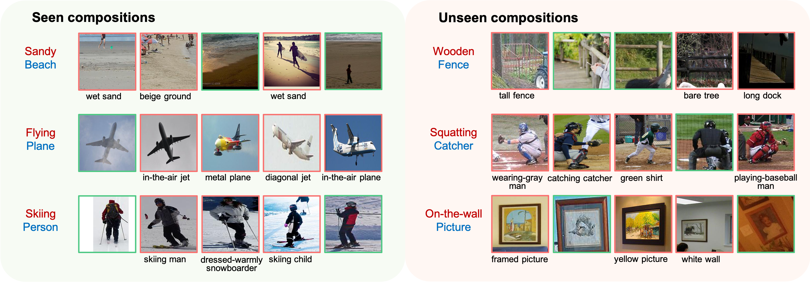

# Attention as Disentangler (CVPR 2023)

[](https://haoosz.github.io/ade-czsl/)
[](https://arxiv.org/abs/2303.15111)


This is the official PyTorch codes for the paper:  

[**Learning Attention as Disentangler for Compositional Zero-shot Learning**](https://arxiv.org/abs/2303.15111)  
[Shaozhe Hao](https://haoosz.github.io/),
[Kai Han](https://www.kaihan.org/), 
[Kwan-Yee K. Wong](http://i.cs.hku.hk/~kykwong/)  
CVPR 2023  

### [Project Page](https://haoosz.github.io/ade-czsl/) | [Code](https://github.com/haoosz/ade-czsl) | [Paper](https://arxiv.org/abs/2303.15111)

<p align="left">
    
</p>

*TL;DR: A simple cross-attention mechanism is efficient to disentangle visual concepts, i.e., attribute and object concepts, enhancing CZSL performance.*

---

## Setup
Our work is implemented in PyTorch and tested with Ubuntu 18.04/20.04.

- Python 3.8
- PyTorch 1.11.0

Create a conda environment `ade` using
```
conda env create -f environment.yml
conda activate ade
```

## Download

**Datasets**: We include a script to download all datasets used in our paper. You need to download any dataset before training the model. Please download datasets from: [Clothing16K](https://drive.google.com/drive/folders/1ky5BvTFrMkPBdAWixHFGLdcfJHfu5e9_?usp=share_link) and [Vaw-CZSL](https://drive.google.com/drive/folders/1CalwDXkkGALxz0e-aCFg9xBmf7Pu4eXL?usp=sharing). You can download other datasets using
```
bash utils/download_data.sh
```
In our paper, we conduct experiments on Clothing16K, UT-Zappos50K, and
C-GQA. In the supplementary material, we also add experiments on Vaw-CZSL.

**Pretrained models**:
DINO pretrained ViT-B-16 can be found [here](https://dl.fbaipublicfiles.com/dino/dino_vitbase16_pretrain/dino_vitbase16_pretrain.pth).
We also provide models pretrained on different datasets under closed-world or open-world settings. Please download the [pretrained models](https://drive.google.com/drive/folders/1s2Ppr2bj8gDwAHBQAz33HbVzmrmbkSAI?usp=sharing) and quickly start by testing their performance using
```
python test.py --log ckpt/MODEL_FOLDER
```

## 🚀 Run the codes
### Training
Train ADE model with a specified configure file `CONFIG_FILE` (e.g, `configs/clothing.yml`) using
```
python train.py --config CONFIG_FILE
```
After training, the `logs` folder should be created with logs, configs, and checkpoints saved.

### Inference
Test ADE model with a specified log folder `LOG_FOLDER` (e.g, `logs/ade_cw/clothing`) using
```
python test.py --log LOG_FOLDER
```
## Results

### Quantitative results

| **Dataset** | **AUC<sup>cw</sup>** | **HM<sup>cw</sup>** | **AUC<sup>ow</sup>**| **HM<sup>ow</sup>** |
|---------------|------------|---------------|------------|---------------|
| Clothing | 92.4 | 88.7 | 68.0 | 74.2 |
| UT-Zappos | 35.1 | 51.1 | 27.1 | 44.8 |
| CGQA | 5.2 | 18.0 | 1.42 | 7.6 |


### Qualitative results

From text 💬 to image 🌄: 


From image 🌄 to text 💬:  


## Citation
If you use this code in your research, please consider citing our paper:
```bibtex
@InProceedings{hao2023ade,
               title={Learning Attention as Disentangler for Compositional Zero-shot Learning},
               author={Hao, Shaozhe and Han, Kai and Wong, Kwan-Yee K.},
               booktitle={CVPR},
               year={2023}}
```

## Acknowledgements
Our project is based on [CZSL](https://github.com/ExplainableML/czsl). Thanks for open source!
